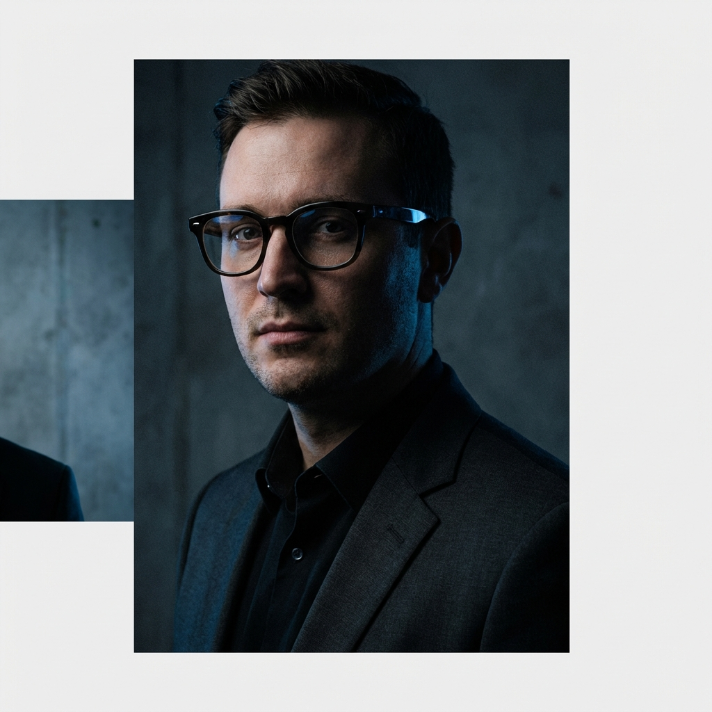

# Antigravity - Premium Portfolio Template

Antigravity is a high-performance, accessible, and open-source portfolio template built with **Next.js 15 (App Router)**, **TypeScript**, and **Framer Motion**.



## 🚀 Key Features

- **Performance First**: Optimized with `next/image` and minimal client-side JS.
- **Modern Stack**: Next.js 15, TypeScript, vanilla CSS Modules.
- **Easy Customization**: Centralized configuration in `src/config/portfolio.ts`.
- **Accessible & SEO Friendly**: Semantic HTML and built-in metadata support.
- **Smooth Animations**: Subtle interactions using Framer Motion.
- **Responsive**: Mobile-first design that looks great on all devices.

## 🛠️ Getting Started

### 1. Fork and Clone
```bash
git clone https://github.com/your-username/antigravity.git
cd antigravity
```

### 2. Install Dependencies
```bash
npm install
```

### 3. Run Development Server
```bash
npm run dev
```

Open [http://localhost:3000](http://localhost:3000) with your browser to see the result.

## 📁 Project Structure

- `src/config/portfolio.ts`: **Your data goes here!**
- `src/components/sections/`: Layout sections (Hero, Projects, etc.).
- `src/styles/tokens.css`: Design system tokens (colors, spacing).
- `public/`: Assets like images and resume.

## 📄 License
This project is licensed under the MIT License - see the [LICENSE](LICENSE) file for details.
